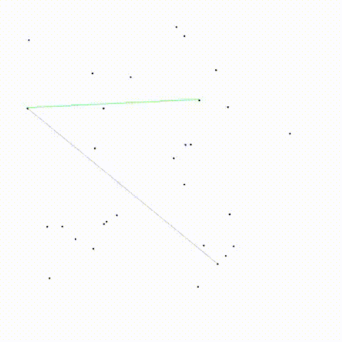
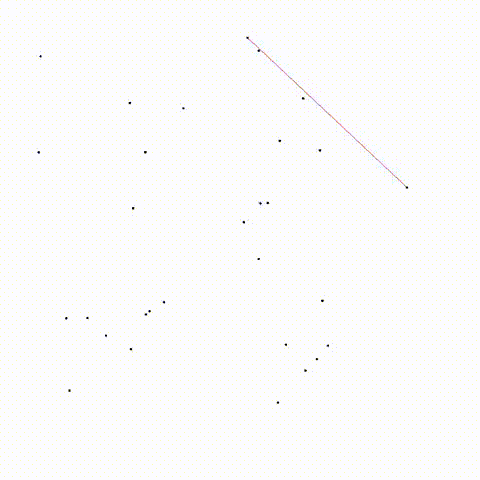

# Tarea 2 y 3: Cerradura Convexa

- Curso: CC5502 Geometría Computacional
- Profesora: Nancy Hitschfeld-Kahler
- Auxiliar: Gustavo Medel
- Ayudante: Catalina Gajardo
- Estudiante: Arianne Peña

Descripción
--------------------------------------------
Este proyecto implementa algoritmos de geometría computacional enfocados en el cálculo de convex hull utilizando dos diferentes estrategias (Gift Wrapping y Graham Scan).

  
  

  <strong>Gift Wrapping Algorithm</strong> &nbsp;&nbsp;&nbsp;&nbsp;&nbsp;&nbsp;&nbsp;&nbsp;&nbsp;&nbsp; <strong>Graham Scan Algorithm</strong>

Compilación y ejecución
--------------------------------------------

Para compilar todo:

    make all
    make generar_puntos

Para generar datos de prueba (puntos):

    make run_generar_puntos

Para ejecutar tests:

    make run_all
    make run_convex_hull_test

Para limpiar los archivos compilados:

    make clean

Además, se trató de hacer una visualización de ambos algoritmos que se pueden ejecutar con:

    make run_visualizacion_gift
    make run_visualizacion_graham

Es necesario tener instalado SMFL para esto último:

    sudo apt-get install libsfml-dev

Estructura del proyecto
--------------------------------------------

**Clases Base:**
- punto.hpp                    : Clase Punto<T> con coordenadas x, y, z
- punto_tests.cpp              : Tests de Punto<T>

- vector.hpp                   : Clase Vector<T> con operaciones geométricas
- vector_tests.cpp             : Tests de Vector<T>

- poligono.hpp                 : Clase Poligono<T> con área, perímetro y orientación
- poligono_tests.cpp           : Tests de Poligono<T>

**Algoritmos Convex Hull:**
- convex_hull_strategies.hpp   : Interfaz Strategy para algoritmos de convex hull
- gift_wrapping.cpp            : Implementación algoritmo Gift WrappingC
- graham_scan.cpp              : Implementación algoritmo Graham Scan
- convex_hull_test.cpp         : Tests para algoritmos de convex hull

**Visualización:**
- visualizacion_gift.cpp       : Visualización algoritmo Gift Wrapping
- visualizacion_graham.cpp     : Visualización algoritmo Graham Scan

**Utilidades:**
- generar_puntos.cpp           : Generador de puntos aleatorios para testing
- random_generator.cpp         : Generador de números aleatorios
- utils.cpp                    : Funciones auxiliares y utilidades generales
- graficar.ipynb               : Notebook para producir gráficos

**Documentación:**
- README.md                    : Documentación principal del proyecto
- enunciado.pdf                : Enunciado original de la tarea
- resultados.txt               : Resultados de experimentos y análisis

**Configuración:**
- makefile                     : Reglas para compilar y correr los tests

Comentarios adicionales
--------------------------------------------

- La tarea utiliza el patrón Strategy para permitir intercambiar algoritmos de convex hull.
- Los tests usan assert y cubren los métodos solicitados.
- Se tiene en cuenta que los algoritmos están en CW, por ahora no supe como visualizarlos en CCW.
- Pido perdón si entregué esta versión, está todo desordenado!